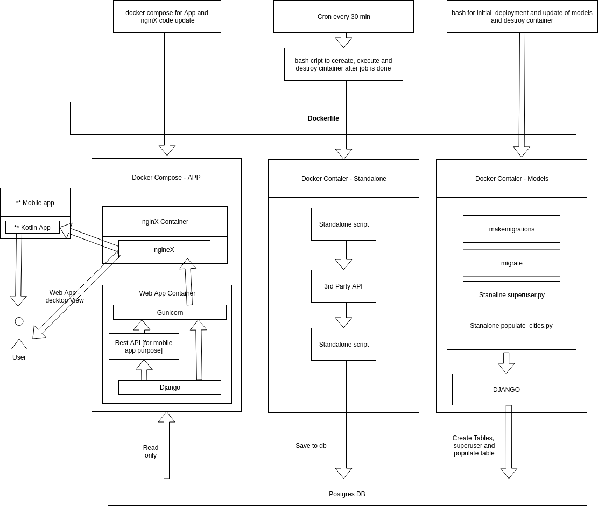

# city weather monorepo 

REQUIREMENTS:  
git, docker, docker-compose, postgres, python3, cron, crontab  

<h2> app diagram </h2>

  

<h2> instalation </h2>  

<h3> create .env, populate it with env as presented in points below, than place file in main folder </h3>

<h3> 1) install postgres: </h3>
apt-get install postgresql  

set up login and password in postgres  

in case you choose other while instaling postgress remember to change USER and PASSWORD in settings.py in DATABASES section  

<H3> 2) set up db name, engine, user, password, host and port for application .env, </h3>   
default are:  

ENV DB_NAME weather  
ENV ENGINE ***  
ENV DB_USER ***  
ENV DB_PASSWORD ***  
ENV HOST_ON_SERVER ***  
ENV PORT_ON_SERVER ***  

<h3> 3) create database name in accordance to DB_NAME </h3>  

<h4> A) initial deployment and restructuring models: </h4>
execute: bash etc/initial_deployment.sh  

choose superuser credentials, and write them in .env:  
ENV SUPERUSER ***  
ENV SU_PASSWORD ***  
ENV SU_EMAIL ***  

<h4> B) to run app: </h4>
choose SSL or no SSL mode, wtite in .env as example:  
ENV SSL_CHECK False
 
Build code with docker compose: docker-compose build  
Run the built container: docker-compose up -d 

<h4> C) to run stanalone script </h4>

execute: bash ect/python_for_cron.sh

cron set up enter cron folder, to add crontab list, execute: crontab cron.txt
to start set up cron: service cron start  
to stop cron: service cron stop  
to check if running:
service cron status

 

** to add new users enter url path /initial_user/ or you can manage it from admin view /admin/ 
(/admin/ have right to delete user from /initial_user/ you can only add one)

